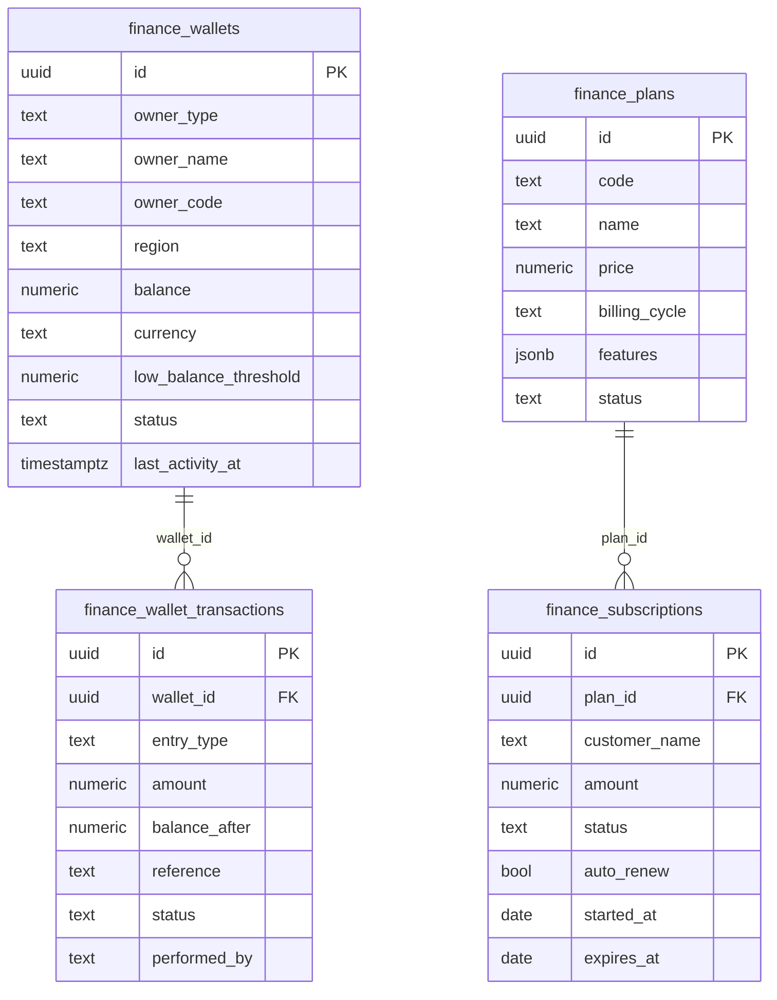

# Finance Manager — Database Schema & ERD

All schema changes live in `supabase/migrations/*.sql` (applied migrations, including
realistic seed data). This document is the human-readable reference.

## ERD

## Tables

| Table | Purpose | Key columns |
|---|---|---|
| `finance_wallets` | Wallet balances per owner | `owner_code`, `balance`, `status` |
| `finance_wallet_transactions` | Wallet ledger entries | `wallet_id`, `entry_type`, `balance_after` |
| `finance_transactions` | Money in/out ledger | `txn_code`, `direction` (`credit`/`debit`), `gateway`, `status` |
| `finance_gateways` | Payment gateway config & health | `code`, `success_rate`, `fee_percent`, `status` |
| `finance_invoices` | Invoices / credit & debit notes | `invoice_no`, `status` (`draft`/`unpaid`/`paid`/`overdue`/`cancelled`), `line_items` |
| `finance_plans` | Subscription plan catalogue | `code`, `price`, `billing_cycle` |
| `finance_subscriptions` | Customer subscriptions | `plan_id`, `status`, `expires_at` |
| `finance_commissions` | Partner commission ledger | `partner_name`, `rate_percent`, `status` |
| `finance_payouts` | Outgoing payouts | `payout_code`, `method`, `status` |
| `finance_expenses` | Operating expenses | `category`, `vendor`, `recurring`, `status` |
| `finance_refunds` | Refund requests | `refund_code`, `mode`, `status` |
| `finance_tax_records` | GST/TDS filings | `period`, `tax_type`, `filing_status` |
| `finance_ai_api_usage` | AI/API consumption | `provider`, `service`, `tokens`, `cost` |
| `finance_ai_controls` | Persisted AI budget/stop controls | `provider`, `service`, `budget`, `auto_stop_percent` |
| `finance_alerts` | Finance alerts feed | `severity`, `category`, `status` |
| `finance_approvals` | Approval queue | `request_type`, `amount`, `status` |
| `finance_fraud_alerts` | Fraud detections | `risk_score`, `reason`, `status` |
| `finance_audit_logs` | Immutable action trail | `actor`, `action`, `entity`, `severity` |
| `finance_daily_metrics` | Daily revenue/expense rollup | `metric_date`, `revenue`, `profit` |
| `finance_activity_heat` | Hourly activity heatmap | `activity_date`, `hour_slot`, `volume` |

## Access rules

- Every table has RLS enabled with **read-only** policies for `anon` and `authenticated`.
- No client-side inserts/updates/deletes: all writes go through server functions
  (`src/lib/finance/finance.functions.ts` → `finance.server.ts`) using the service role,
  and each write appends a row to `finance_audit_logs`.
- Wallet adjustments run through the `finance_adjust_wallet_atomic` SQL function, which
  locks the wallet row, guards against negative balances, and writes the ledger entry in
  the same transaction.
